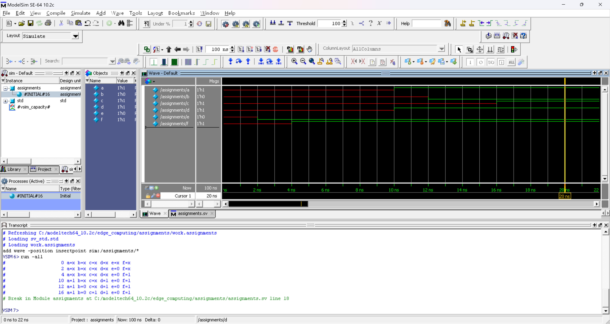

# 实验 2 assignments | 阻塞、非阻塞对比

> **实验人:** 智能 212 史胤隆 | **指导教师:** 余乐

- **tb_my_buf.sv**

  ```systemverilog
  `timescale 1ns/1ns
  module assignments();
      logic a, b, c, d, e, f;
      initial begin
          a = #10 1'b1;   //time 10
          b = #2  1'b0;   //time 12
          c = #4  1'b1;   //time 16
      end
    initial begin
          d <= #10 1'b1;  // time 10
          e <= #2  1'b0;  // time 2
          f <= #4  1'b1;  //time 4
      end
      initial begin
        $monitor ($time, , "a=%b b=%b c=%b d=%b e=%b f=%b",
                    a, b, c, d,e, f);
          #100 $stop;
      end
  endmodule

  ```

- 控制台输出

  ```text
  #                    0 a=x b=x c=x d=x e=x f=x
  #                    2 a=x b=x c=x d=x e=0 f=x
  #                    4 a=x b=x c=x d=x e=0 f=1
  #                   10 a=1 b=x c=x d=1 e=0 f=1
  #                   12 a=1 b=0 c=x d=1 e=0 f=1
  #                   16 a=1 b=0 c=1 d=1 e=0 f=1
  ```

- 输出波形

  
